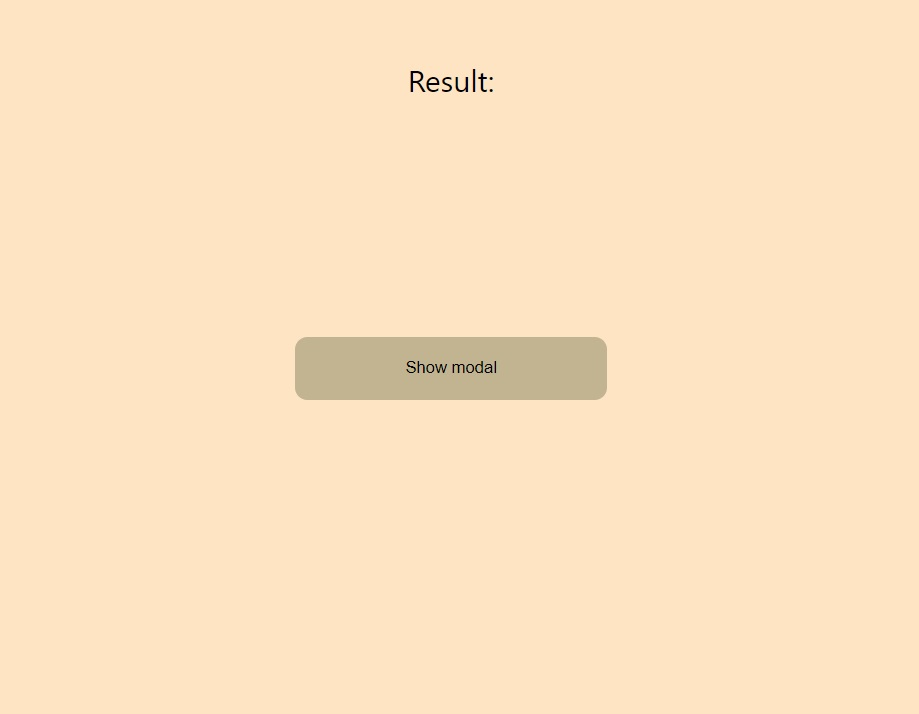
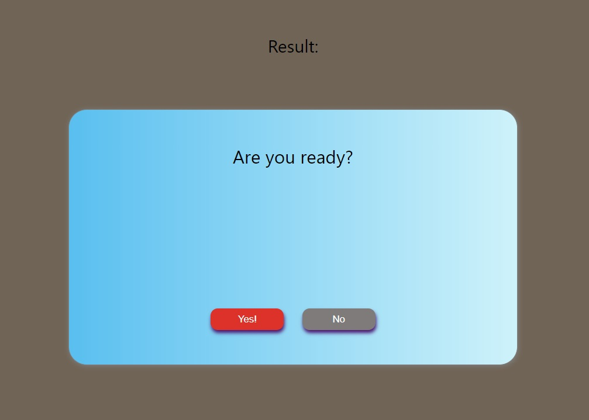
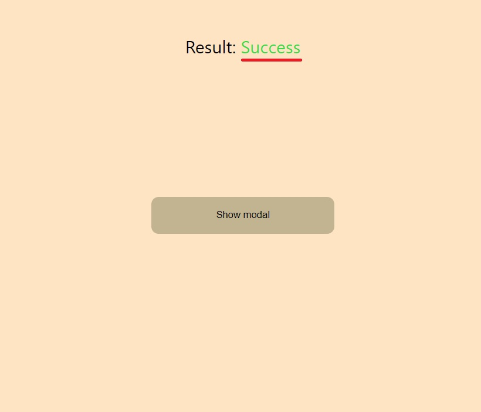

# React Promise Modal with Context
This project implemented with:
`react hooks`, `context API` and `Promise`

### Demo
**Note: Project was deployment with [google firebase](https://firebase.google.com/)** .\

Open [modal-context](https://modal-context.web.app/) for see result of work

## `Screenshots`
Default window to show modal:
 

Modal is opened:

Result of modal work when "Yes" clicked! :

